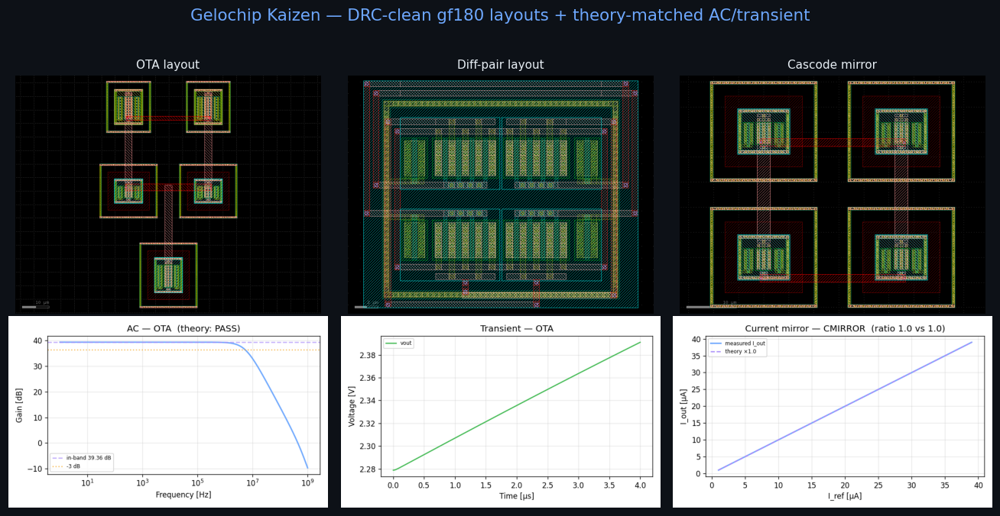
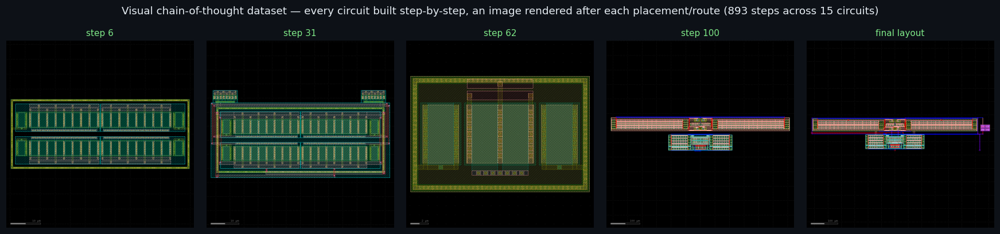

# Gelochip

**Describe an analog/RF circuit in plain English → get a DRC-clean gf180 GDSII layout.**
A **Self improving Agentic AI** — a local RAG agent (no cloud, no fine-tuning) that designs,
verifies (Magic DRC + AC/transient vs. theory), *sees its own rendered layout*, and learns
from every run.



> Inspired by [Chipster](https://github.com/adeirman46/Chipster) (digital flow via OpenLane) — Gelochip is its analog/RF counterpart.

---

## ▶ Run with Docker (recommended)

The published image bundles **everything** — OS, EDA tools (magic · netgen · ngspice ·
klayout), gf180 PDK, datasets, embedding model, prebuilt ChromaDB, PixelatedRF weights,
and both web apps. Nothing to install or build. One model, `qwen3.5:9b`, serves
reasoning, code, **and** vision.

```bash
curl -O https://raw.githubusercontent.com/adeirman46/Gelochip/main/docker-compose.yml
docker compose up                # pulls the image + LLM, then serves:
#   Gelochip Studio   → http://localhost:8090
#   (one app, three tabs: Prompt → GDSII · Chip Studio · PixelatedRF)
```

**NVIDIA GPU** (much faster generation) — add the override (needs the
[NVIDIA Container Toolkit](https://docs.nvidia.com/datacenter/cloud-native/container-toolkit/latest/install-guide.html)):

```bash
curl -O https://raw.githubusercontent.com/adeirman46/Gelochip/main/docker-compose.gpu.yml
docker compose -f docker-compose.yml -f docker-compose.gpu.yml up
```

Image: [`adeirman2705/gelochip-studio`](https://hub.docker.com/r/adeirman2705/gelochip-studio)
(~4.4 GB). The LLM auto-downloads once into a volume. See [docs/DOCKER.md](docs/DOCKER.md)
for persistence and building your own image.

---

## ▶ Run from source

```bash
git clone https://github.com/adeirman46/Gelochip.git && cd Gelochip
./scripts/run.sh                 # Gelochip Studio → http://localhost:8090
```

`run.sh` sets up the `.venv` (via `uv`), pulls the model, and launches **one unified app**
at `http://localhost:8090` (port optional: `./scripts/run.sh 8095`). Everything is now a
tab inside **Gelochip Studio**:

| Tab | What it does |
|---|---|
| **Prompt → GDSII** | the self-improving RAG agent — plan · research · generate · DRC · self-correct |
| **Chip Studio** | IP library (15 DRC-clean blocks) · gf180 padframe · drag-to-wire + AI pin-connect |
| **PixelatedRF** | draw an S₁₁ target → inverse-designed pixel layout + GDS (served at `/pixelrf`) |

> The standalone PixelatedRF server and the legacy LangGraph web UI have been **merged into
> Studio** — there is just one app now.

**Needs:** `ollama` · `magic`, `netgen`, `ngspice` · `PDK_ROOT` → gf180 PDK ·
`numpy<2.0` (gdsfactory<8). The React UI ([`app/frontend/`](app/frontend/)) needs
**Node 18+** — build it once with `cd app/frontend && npm install && npm run build`;
until then the backend serves a vanilla-JS fallback, so it works without Node.

> **PixelatedRF assets:** its model weights (`models/pixelatedrf/`) and EM datasets
> (`data/pixelatedrf/`) are too big for git. The Docker image already includes them;
> for source use, fetch them via `./scripts/fetch_assets.sh` (set your Drive link first).
> Studio itself needs none of this — it auto-builds its ChromaDB from the in-repo data.

---

## Gelochip Studio (the main app)

A self-correcting **Retrieval-Augmented Generation** agent. A local `qwen3.5:9b`
(Ollama) is grounded on **three local ChromaDB collections** and corrects itself
against real Magic DRC + ngspice — corrections are injected as in-context feedback,
never gradients. The 3 collections **auto-build on first launch** (instant after that).

| # | Collection | Contents |
|---|---|---|
| 1 | `glayout_knowledge` | **visual chain-of-thought** construction dataset (per-step NL + code + rendered image) + 15 DRC-clean circuit blocks |
| 2 | `rf_theory` | RF/mmWave books, papers, EE-QA, PySpice corpus |
| 3 | `error_feedback` | error→fix memory (starts empty, grows at runtime) |

> Inspect or rebuild any collection from the notebooks:
> [manage_knowledge_db.ipynb](notebooks/manage_knowledge_db.ipynb) (browse/search/delete) ·
> [ingest_to_chromadb.ipynb](notebooks/ingest_to_chromadb.ipynb) (how data is ingested + what the UUID folders mean).

**Four tools** in the web UI:
1. **Prompt → GDSII (RF)** — live `plan → research → retrieve → generate → DRC → fix → persist`
   with GDS preview, extracted SPICE, AC/transient plots, and code. A **Researcher** agent
   (arXiv / web / GitHub via crawl4ai → temporary RAG) and the retrieved knowledge are shown
   in a **Knowledge & Research** panel so you can verify the agent's sources *before* it
   generates. **Vision-in-the-loop:** on a failed attempt the corrector is shown the *rendered
   GDS* (not just the DRC text) and reasons about where the geometry is wrong. On a DRC-clean
   result the research + verified code are persisted into ChromaDB. Each run lands in a readable
   project folder `outputs/kaizen/<slug>_<date>/` (code · data · database · images · link · text).
   A **left history sidebar** saves every run — click to restore its full state.
2. **IP Library** — 15 DRC-clean blocks (with real µm² area), drag-n-drop onto the chip.
3. **Padframe** — gf180 pad ring (sscs-chipathon-2025 / caravel-gf180mcu compatible).
4. **Pin-Connect agent** — proposes pin↔pin nets + pinout names, draws the wires.

The [architecture notebook](notebooks/kaizen_architecture/) is the spec the web app
follows. All 15 circuits in `data/circuits/` are **DRC-clean + theory-verified**:

| class | circuits | theory check |
|---|---|---|
| switch | transmission_gate | ~0 dB pass-through |
| follower | fvf, n_block, p_block | gain ≈ unity |
| current mirror | current_mirror, stacked_current_mirror, low_voltage_cmirror | DC copy ratio |
| amplifier | diff_pair, diff_pair_cmirrorbias, ota, opamp, differential_to_single_ended_converter, diff_pair_stackedcmirror, row_csamplifier | DC gain / GBW |
| 2-stage | opamp_twostage | ~43 dB (> single stage) |

Each circuit is also captured as a **visual chain-of-thought** sequence — every placement
and route, with the layout re-rendered after each step (893 steps across the 15 circuits)
— so the agent learns *how* a block is built, not just its final code.



---

## Repository layout

```
Gelochip/
├── data/                  # all datasets
│   ├── circuits/          #   15 DRC-clean circuit blocks (IP library)
│   ├── visual_dataset/    #   visual chain-of-thought: dataset.jsonl + images/ (collection 1)
│   ├── glayout_code/      #   step-tracer tooling (step_recorder, nl_templates, renderer)
│   ├── rf_theory/         #   RF/mmWave corpus           (collection 2)
│   └── pixelatedrf/       #   antenna_dataset.mat, data_split.npz
├── models/                # all model weights
│   ├── pixelatedrf/       #   forward / inverse EM models
│   └── layoutrl/          #   DRC-corrector PPO policy
├── src/gelochip/
│   ├── kaizen/            # RAG agent: config, collections, executor, testbench, agent, studio
│   ├── pixelrf/           # PixelatedRF inverse-design app + inference
│   ├── glayout/  gl/  verification/   # gdsfactory layout + DRC/LVS/PEX
├── app/                   # the web app (one unified Studio)
│   ├── kaizen_app.py      #   FastAPI backend — serves Studio + mounts PixelatedRF at /pixelrf
│   ├── mcp_server.py      #   MCP server for Claude Desktop
│   ├── frontend/          #   React (Vite) SPA — 3 tabs (Prompt · Chip Studio · PixelatedRF)
│   └── static/            #   web/ (built SPA, served at /) · kaizen/ (vanilla fallback)
├── scripts/               # run.sh (launcher) · kaizen_ingest.py · build_clean_datasets.py · …
├── notebooks/             # kaizen_architecture/ · pixelatedRF/ · …
├── Dockerfile · docker-compose.yml   # one-command self-contained stack
└── docs/                  # DOCKER.md · installation.md · architecture.md · …
```

---

## More

<details>
<summary>Python API · building blocks · MCP server</summary>

```python
# Build a block directly
from gelochip.glayout.pdk.gf180_mapped import gf180_mapped_pdk as pdk
from gelochip.core.cells import lna_cascode
lna_cascode(pdk, gm_width=40.0, gm_fingers=10, cas_width=40.0, cas_fingers=10).write_gds("lna.gds")
```

```bash
# MCP server for Claude Desktop
uv run python app/mcp_server.py
```

**Verification flow:** code exec → DRC (Magic) → LVS (Netgen) → PEX + SPICE (ngspice).
Missing tools are skipped gracefully; fastest setup is [IIC-OSIC-TOOLS Docker](https://github.com/iic-jku/iic-osic-tools).

**PixelatedRF:** retrain in `notebooks/pixelatedRF/02_train.ipynb` (needs `data/pixelatedrf/data_split.npz` from `01_dataset.ipynb`); weights in `models/pixelatedrf/`.

**ALIGN (SPICE → GDS):** automatic analog place-and-route in
[`notebooks/align/`](notebooks/align/) — feed a SPICE netlist, get a placed-and-routed GDS, rendered
with the **KLayout** engine (clean theme + pin labels). ALIGN is built into its **own** venv (it
pins `pydantic<2`); `bash notebooks/align/setup_align.sh` installs it + PDKs / examples. Use the
`spice2gds` module or the notebooks: [`sky130_examples.ipynb`](notebooks/align/sky130_examples.ipynb)
(5 circuits, open **sky130** PDK) and [`gf180_align.ipynb`](notebooks/align/gf180_align.ipynb)
(10 circuits, **GF180MCU** via `GF180_PDK` — extends ALIGN, which ships only sky130, to gf180 using
real gf180 layer numbers + rules from `gf180_mapped_pdk`). Run gf180 **DRC + LVS sign-off before
tapeout** (`gf180_mapped_pdk.drc_magic` / `.lvs_netgen`).

</details>

---

## Documentation

- [Kaizen architecture](notebooks/kaizen_architecture/README.md) — the RAG agent, collections, 15 circuits
- [Docker](docs/DOCKER.md) — one-command self-contained deploy
- [Installation](docs/installation.md) · [Architecture](docs/architecture.md) · [PixelatedRF](docs/pixelated-rf.md) · [Datasets](docs/datasets.md)
- [ALIGN SPICE → GDS](notebooks/align/README.md) — experimental automatic analog layout (isolated venv)

## Team

**Bandung Institute of Technology (ITB), Indonesia**

**Faculty advisor:** Nana Sutisna, S.T., M.T., Ph.D.

**Members:**
- William Anthony
- Benedictus Kenneth Setiadi
- Yozia Gedalya Marcho Ginting
- Ade Irman Budi Hendriawan
- Christopher Justin Kurniawan

---

## License

MIT — see [LICENSE](LICENSE).
